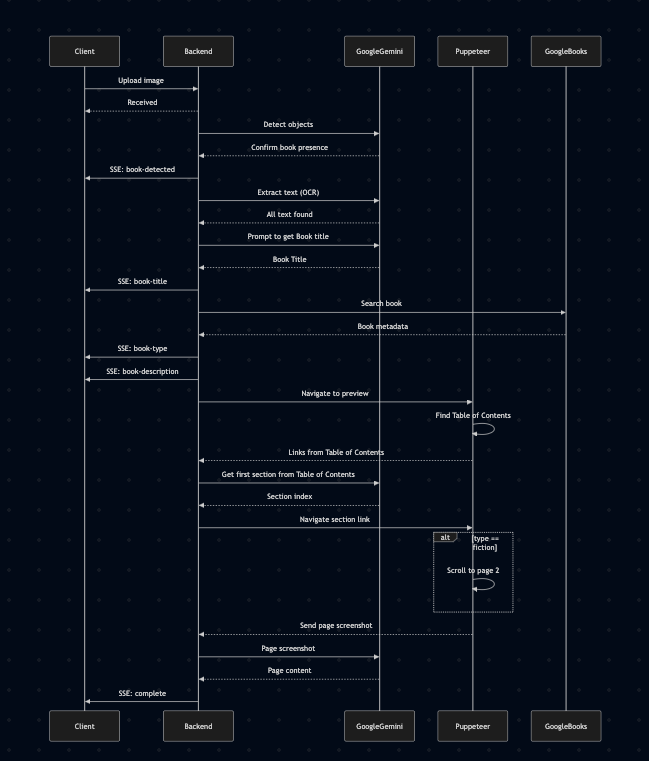

# Book Detector

A modern web application that analyzes book cover images to extract information and provide insights about the book. Built with TypeScript and Turborepo, this project consists of two main services: a Next.js frontend and a Node.js backend processor.

## Features

- Upload book cover images via drag-and-drop or file selection
- Real-time analysis feedback using Server-Sent Events (SSE)
- Automatic book detection using Google Vision AI
- Title extraction using OCR
- Fiction/Non-fiction classification using Google Books API
- Book content preview using Puppeteer web scraping
- Responsive design for both desktop and mobile
- History tracking with IndexedDB storage
- Handle partial success cases (when only some info is found)

## Demo


https://github.com/user-attachments/assets/05354567-96ce-4957-8eea-d6f71b85439c


## Decision Records

- **Multi-stage Analysis Pipeline**
  - *Context*: Book analysis involves multiple API calls and processing steps
  - *Decision*: Break analysis into discrete stages with individual event types
  - *Rationale*: Allows partial results to be useful even if later stages fail
  - *Consequences*: More robust error handling and better user experience

- **Vision AI for Multiple Purposes**
  - *Context*: Need both object detection and text extraction
  - *Decision*: Leverage Vision AI for both book detection and OCR
  - *Rationale*: Unified API for image analysis tasks, consistent quality across features
  - *Consequences*: Efficient API usage and simplified integration

- **Google Gemini AI for Text Processing**
  - *Context*: Need accurate book title extraction and section identification
  - *Decision*: Use Gemini AI with custom prompts instead of rule-based parsing
  - *Rationale*: Book covers and TOC can be complex and varied. AI provides better accuracy in identifying relevant information
  - *Consequences*: Dependency on external AI service but better accuracy and adaptability

- **Server-Sent Events (SSE) for Real-time Updates**
  - *Context*: Need to provide real-time feedback during the book analysis process
  - *Decision*: Use SSE instead of WebSocket or polling
  - *Rationale*: SSE is simpler to implement, has native browser support, and is perfect for one-way server-to-client communication
  - *Consequences*: Better user experience with immediate feedback, lower server load compared to polling

- **Google Books API for Book metadata and content extraction**
  - *Context*: Need book metadata for classification and preview
  - *Decision*: Use Google Books API for metadata retrieval
  - *Rationale*: Official API for book metadata, provides accurate and up-to-date information
  - *Consequences*: Better accuracy and reliability for book metadata, dependence on external service and that a public preview is available

- **Puppeteer for Book Content Extraction**
  - *Context*: Need to extract book content from Google Books previews
  - *Decision*: Use Puppeteer with screenshot + OCR approach instead of direct API calls
  - *Rationale*: Google Books API doesn't provide direct access to book content. Puppeteer allows us to navigate the preview interface and capture content
  - *Consequences*: More complex setup but more reliable content extraction

- **IndexedDB for History Storage**
  - *Context*: Need to persist analysis history on the client
  - *Decision*: Use IndexedDB instead of localStorage or server storage
  - *Rationale*: Better performance for larger datasets, supports structured data, and works offline
  - *Consequences*: More complex implementation but better scalability and user experience

- **Early Book Validation**
  - *Context*: Need to validate if an uploaded image is actually a book before proceeding with analysis
  - *Decision*: Use Vision AI object detection as first step in the pipeline
  - *Rationale*: Prevents unnecessary API calls and processing for non-book images, provides immediate feedback to users
  - *Consequences*: Additional API call but better user experience and resource optimization

- **Partial Success Handling**
  - *Context*: Analysis pipeline has multiple stages that could fail independently
  - *Decision*: Implement a partial success state and store all successfully retrieved information
  - *Rationale*: Even if some stages fail (e.g., content extraction), other information (e.g., title, type) is still valuable to users
  - *Consequences*: More complex state management but better user experience and data preservation

## Current Limitations

- Using free tiers for all third party services. Is possible that we get rate limited.
- Scraping flow is not 100% reliable. We depend on the book having a preview available for public access.
- Scraping flow needs anti bot tech (e.g. user agent rotation, CAPTCHA solvers, proxy servers)
- Google Vision free tier doesn't always detect books. Sometimes it thinks it's another object or sometimes it doesn't detecte anything.
- Implemented architecture not suitable for a real word application. See more in [Real World Scenario](#real-world-scenario).

## Project Structure

```
/apps
  /processor          # Backend service for image analysis
    /src
      /dtos          # Data transfer objects
      /lib           # External API integrations
      /services      # Core business logic
      /prompts       # AI prompts for Gemini
  /web               # Next.js frontend application
    /app             # Next.js app router
    /components      # React components
    /hooks          # Custom React hooks
    /lib            # Utility functions and types
```

## Backend Service (apps/processor)

The backend service handles image analysis and book information retrieval using several external APIs:

1. Google Vision AI for object detection and OCR
2. Google Books API for metadata and classification
3. Google Gemini AI for enhanced text processing
4. Puppeteer for web scraping book content

### Analysis Flow



<details>
<summary>Mermaid code</summary>

sequenceDiagram
    participant Client
    participant Backend
    participant GoogleVision
    participant Puppeteer

    participant GoogleGemini
    participant GoogleBooks

    Client->>Backend: Upload image
    Backend-->>Client: Received
    Backend->>GoogleVision: Detect objects
    GoogleVision-->>Backend: Confirm book presence
    Backend->>Client: SSE: book-detected

    Backend->>GoogleVision: Extract text (OCR)
    GoogleVision-->>Backend: All text found
    Backend->>GoogleGemini: Prompt to get Book title
    GoogleGemini-->>Backend: Book Title
    Backend->>Client: SSE: book-title

    Backend->>GoogleBooks: Search book
    GoogleBooks-->>Backend: Book metadata
    Backend->>Client: SSE: book-type
    Backend->>Client: SSE: book-description

    Backend->>Puppeteer: Navigate to preview
    Puppeteer->>Puppeteer: Find Table of Contents
    Puppeteer-->>Backend: Links from Table of Contents

    Backend->>GoogleGemini: Get first section from Table of Contents
    GoogleGemini-->>Backend: Section index
    Backend->>Puppeteer: Navigate section link

    alt type == fiction
      Puppeteer->>Puppeteer: Scroll to page 2
    end
    
    Puppeteer-->>Backend: Send page screenshot
    Backend->>GoogleVision: Page screenshot
    GoogleVision-->>Backend: Page content

    Backend->>Client: SSE: complete
</details>


### Key Components

#### BookDetectorService

The main service that orchestrates the book detection process:

1. **Book Detection**
   - Uses Google Vision AI to detect if the image contains a book
   - Confidence threshold based detection

2. **Title Extraction**
   - OCR using Google Vision AI
   - Enhanced with Google Gemini AI to get the exact title from the text extracted

3. **Book Classification**
   - Uses Google Books API
   - Category-based fiction/non-fiction detection
   - Metadata extraction

4. **Content Extraction**
   - Web scraping using Puppeteer
   - Scrape table of content
   - Google Gemini returns what it seems to be the first section
   - Navigate to section link using Puppeteer
   - If book is fiction, scroll to page 2
   - Take screenshot using Puppeteer
   - OCR on page screenshots using Google Vision

### API Endpoints

#### POST /analyze
Analyzes a book cover image.

**Request:**
- Method: POST
- Content-Type: multipart/form-data
- Body: Form data with 'file' field containing the image

**Response:**
```typescript
{
  isBook: boolean;
  title?: string;
  type?: "fiction" | "non-fiction";
  text?: string;
  description?: string;
  error?: string;
}
```

#### GET /events
SSE endpoint for real-time updates.

**Events:**
- book-detected: Image contains a book
- book-title: Title extracted
- book-type: Fiction/non-fiction classification
- book-description: Book description found

## Frontend Application (apps/web)

The frontend is built with Next.js 13+ and uses modern React patterns and hooks for state management.

### Key Components

#### FileUploader
Main component that handles:
- File upload via drag-and-drop
- SSE connection management
- Analysis state management
- History integration

#### UploaderCard
Handles the upload interface:
- Drag-and-drop zone
- Upload progress indication
- Analysis feedback display
- Error handling

#### HistoryPanel
Manages analysis history:
- Persistent storage using IndexedDB
- Expandable book details
- Timestamp tracking
- State-based styling

#### BookContent
Displays book information:
- Title and type badges
- Description display
- Page content preview
- Responsive layout

### State Management

```typescript
type AnalysisResult = {
  title: string;
  text: string;
  description: string;
  type: "fiction" | "non-fiction";
};

type HistoryItem = {
  id: string;
  timestamp: Date;
  imageUrl: string;
  state: "success" | "partial-success" | "error";
  result?: AnalysisResult;
  error?: string;
};
```

# Real World Scenario

Note: Only will explain changes to current solution

Current implementation handles everything in the same service.
Scaling this to millions of users would require a different architecture:
- AWS API Gateway: Handles API request routing, authentication, rate limiting, and CORS.
- AWS Step Functions: Orchestrate the processing workflow. Each step of the process is managed by a Lambda.
- AWS S3: Store book images received, and screenshots of the book's content so it can be easily passed between steps and avoid surpassing size limits.
- Postgres Database: Store metadata or results so it can be reused for future queries.
- Add more APIs as back up where book content is extracted from. We are 100% depending on GoogleBooks now.
- Server-Sent Events connections are being saved in memory. Some options to consider: 
  - Use EC2 with persistance NodeJS instances that handle SSE connections. Lambda use this to forward events. 
  - Use API Gateway Management API and a database for handling WebSocket connections with our Lambdas.
  - Do polling instead of SSE or WebSocket. Fetch every ~5 seconds the job status.
- Rate limiting: use an external database for handling it, like Redis.

## Getting Started

1. Clone the repository
2. Install dependencies:
   ```bash
   pnpm install
   ```

3. Set up environment variables:
   - Copy `.env.example` to `.env.local` in both apps
   - Add your API keys

4. Start development servers:
   ```bash
   pnpm dev
   ```

5. Access the application:
   - Frontend: http://localhost:3000
   - Backend: http://localhost:3002

## Development

### Backend Development
```bash
cd apps/processor
pnpm dev
```

### Frontend Development
```bash
cd apps/web
pnpm dev
```

## Production Deployment

The application is designed to be deployed on Vercel:

1. Frontend: Deploy the `apps/web` directory
2. Backend: Deploy the `apps/processor` directory as a serverless function

## Contributing

1. Fork the repository
2. Create a feature branch
3. Commit your changes
4. Push to the branch
5. Create a Pull Request

## License

MIT License - see LICENSE file for details
